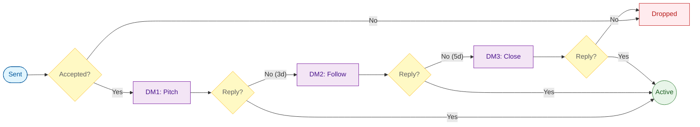

---
tags:
  - career
  - strategy
---

_Version: 1.0 — Built from week 1–3 operational data_ _Last updated: April 2026_

---

## CORE PHILOSOPHY

Volume is rewarded to systems that work, not to ones that don't. If the problem is in the system, adding more volume does nothing but bloat it. Fix the system first, then scale.

The goal of first contact is not a yes. It is a reply — any reply. A "not right now" is a win. The conversation being open is a win.

---

## CHANNELS
**LinkedIn first, email as escalation.**

- LinkedIn DM after accepted connect = lower barrier, they already said yes once
- Email = use only if connect sits pending for 7 days and ICP fit is strong enough to justify the effort
- Never follow up on a pending connect via LinkedIn — it reads as vendor behavior

---

[[TPN LinkedIn note framework]]

---

## THE FULL LIFECYCLE



**Maximum 3 DMs. Maximum 2 follow-ups. After that it's done.**

---

## DM TEMPLATES

### DM #1 — The pitch

Three short paragraphs, 5 sentences maximum.

Structure:

```
[One specific observation about their product or problem]
[What you do + DocMatch as proof + demo link]
[Low-friction ask — not a call, tied to their specific situation]
```

Example (Fintech/dashboard):

> "Fintech dashboards that show complex data without overwhelming the user are genuinely hard to get right — most products either dumb it down or bury users in numbers.
> 
> I'm a Design Engineer — I build functional prototypes that prove the UX works before engineering commits to it. I recently shipped DocMatch, an AI triage system with a multi-layer fallback and a provider dashboard: symptomlink.netlify.app
> 
> Happy to show you how I'd approach a dashboard problem if you have one on the roadmap."

**Rules:**

- No "let me know if you're interested"
- No "would love to hop on a call"
- Always include the demo link — it's the lowest friction ask possible

### DM #2 — Follow-up (day 3, no reply)

One sentence. Reference the demo, not the pitch.

> "Wanted to follow up briefly — the DocMatch demo is live if that's easier than reading about it: symptomlink.netlify.app"

### DM #3 — Close the loop (day 8, no reply)

Give them an easy out. Counterintuitively increases reply rate because pressure is gone.

> "I'll leave it here — if the timing is ever right for a frontend prototype, you know where to find me."

No link, no ask. Clean exit.

---

## ICP CRITERIA

A valid target must meet **all** of the following:

- [ ] Pre-Series A (Seed or Pre-Seed)
- [ ] B2B SaaS or HealthTech (primary verticals)
- [ ] Founder active on LinkedIn in the last 30 days
- [ ] Company has a product page or app store listing
- [ ] No in-house Designer/UX/Frontend job posting live

**Instant disqualifiers:**

- Robotics / hardware companies (no UX prototype need)
- Agencies
- Companies with 50+ employees (past the stage where you add value)
- Founders with zero LinkedIn activity in 30 days (unreachable)

---

## MESSAGE ANGLES

Test one angle per outreach session. Log which angle was used on every contact.

**Angle A — Prototype speed** Lead with: how fast you can take a concept to a working, testable prototype. DocMatch built in 3 weeks. Engineers freed up to focus on core product.

**Angle B — UX validation before engineering** Lead with: the cost of building the wrong UX at scale. Functional prototype proves the UX is right before a single sprint is spent. DocMatch as proof.

---

## STATUS DEFINITIONS

|Status|Meaning|
|---|---|
|`Pending Connect`|Request sent, not yet accepted|
|`Connected`|Accepted, DM not yet sent|
|`Active`|DM sent, conversation open|
|`Dropped`|Dead — no acceptance after 7 days, or no reply after 2 follow-ups|

---

## OUTCOME DEFINITIONS

|Outcome|When|
|---|---|
|`Cold`|Dropped — no acceptance or no reply after 2 follow-ups|
|`Warm`|Replied but no next step yet|
|`Call/Demo`|Agreed to see the demo or get on a call|
|`Converted`|Paid work or job offer|

---

## FOLLOW-UP DATE LOGIC

Timer runs from **last action date**, not sent date.

|Situation|Follow-up date|
|---|---|
|Pending connect|Sent + 7 days (expiry)|
|Connected, 0 DMs sent|Last action + 1 day (send DM fast)|
|Connected, 1 DM sent|Last action + 3 days|
|Connected, 2 DMs sent|Last action + 5 days|
|Active, 0 follow-ups|Last action + 3 days|
|Active, 1 follow-up|Last action + 5 days|
|Active, 2 follow-ups|Blank — mark Dropped|
|Dropped|Blank — no follow-up|

### Google Sheets formula (column H, row 2)

```
=IF(OR(E2="Dropped", ISBLANK(E2)), "",
  IF(E2="pending connect", F2+7,
    IF(E2="connected",
      IF(J2=0, IF(ISBLANK(G2), F2+1, G2+1),
        IF(J2=1, G2+3,
          IF(J2=2, G2+5, "")
        )
      ),
      IF(E2="active",
        IF(J2=0, G2+3,
          IF(J2=1, G2+5, "")
        ),
      "")
    )
  )
)
```

_Columns assumed: E = Status, F = Sent, G = Last Action, H = Follow-up Date, J = Follow-ups count_

---

## SPREADSHEET COLUMNS

|Column|Field|Type|Notes|
|---|---|---|---|
|A|Name|Manual||
|B|Company|Manual||
|C|Contact (URL)|Manual|LinkedIn profile|
|D|Response|Manual|Y/N|
|E|Status|Manual dropdown|Pending Connect / Connected / Active / Dropped|
|F|Sent|Manual date|Date connect request sent|
|G|Last Action|Manual date|Update on every action — not same as Sent|
|H|Follow-up Date|**Formula**|See formula above|
|I|Follow-up ch.|Manual dropdown|LinkedIn / Email|
|J|Follow-ups|Manual count|Increment on every follow-up sent|
|K|Days since last action|**Formula**|`=IF(ISBLANK(G2), "", TODAY()-G2)`|
|L|Outcome|**Formula**|`=IF(E2="Dropped","Cold", IF(E2="active","Warm",""))`|
|M|Needs action flag|**Formula**|`=IF(AND(NOT(ISBLANK(H2)), H2<=TODAY(), E2<>"Dropped"), "⚠️ Act today", "")`|
|N|Expire flag|**Formula**|`=IF(AND(E2="pending connect", F2+7<=TODAY()), "⚠️ Expire", "")`|
|O|TPN Used|Manual|Y/N|
|P|Angle|Manual|A / B / TPN-only|
|Q|Industry|Manual||
|R|Social Proof Used|Manual||
|S|Contact Method|Manual||
|T|Log|Manual|Free text — most important column|
|U|Source|Manual|Apollo / YC list / etc|

---

## WEEKLY OUTREACH RHYTHM

|Day|Task|Time|Hard stop|
|---|---|---|---|
|Sunday|Compile 10 qualified targets|15 min|—|
|Monday|Review + follow-ups on prior contacts|20 min|—|
|Tuesday|Outreach session — 3 targets, Angle A|08:00|09:00|
|Thursday|Outreach session — 3 targets, Angle B|08:00|09:30|
|Friday|Week review — angle comparison, update TELOS|30 min|—|

**Rules:**

- Research (Sunday) and execution (Tuesday/Thursday) are always separate
- Outreach sessions are always morning — never afternoon after a disrupted day
- Log immediately after every session — if it's not in the spreadsheet it doesn't exist
- 3 contacts per session — volume scales only when the system produces replies

---

## OPEN QUESTIONS (resolve through data)

1. Which angle (A vs B) gets more replies — measure by week 4
2. Does Apollo + TPN outperform YC list + old method — currently suggesting yes
3. At what weekly volume does quality start to degrade

---

_This document is operational, not aspirational. Update it when the data tells you something new, not when something sounds better in theory._