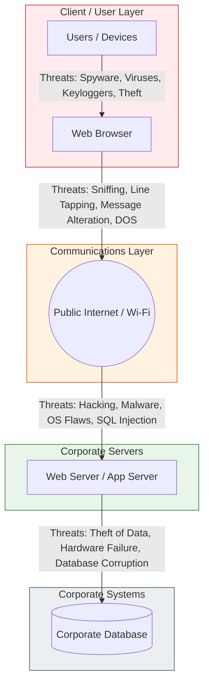
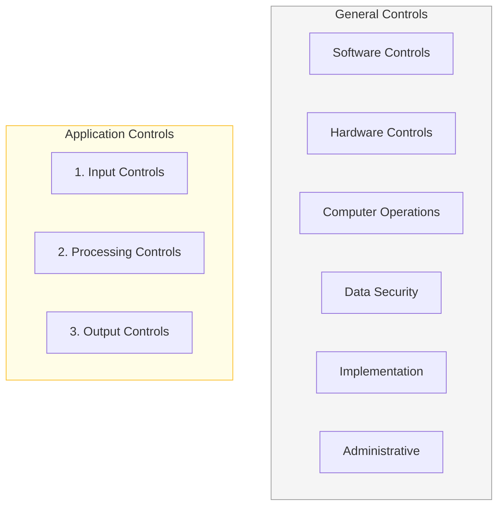
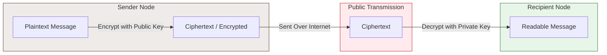

# Management Information Systems

### Управување со информациски системи

**Chapter 8: Securing Information Systems** _Course:_ ICS16M01

_Lecturer:_ Aleksandar Karadimce, PhD

_Institution:_ University St. Paul the Apostle (University for Information Science & Technology - UIST)

_Textbook Reference:_ _Management Information Systems: Managing the Digital Firm_, 17th Edition (ISBN: 978-0-13-697127-6) by Kenneth C. Laudon and Jane P. Laudon (Pearson Education, 2022).

## Table of Contents

1. [Learning Objectives](#learning-objectives "null")
    
2. [8.1 Why are Information Systems Vulnerable to Destruction, Error, and Abuse?](#81-why-are-information-systems-vulnerable-to-destruction-error-and-abuse "null")
    
3. [8.2 What is the Business Value of Security and Control?](#82-what-is-the-business-value-of-security-and-control "null")
    
4. [8.3 Components of an Organizational Framework for Security and Control](#83-components-of-an-organizational-framework-for-security-and-control "null")
    
5. [8.4 Tools and Technologies for Safeguarding Information Resources](#84-tools-and-technologies-for-safeguarding-information-resources "null")
    
6. [Hands-On MIS Projects](#hands-on-mis-projects "null")
    

## Learning Objectives

- **8.1** Why are information systems vulnerable to destruction, error, and abuse?
    
- **8.2** What is the business value of security and control?
    
- **8.3** What are the components of an organizational framework for security and control?
    
- **8.4** What are the most important tools and technologies for safeguarding information resources?
    

## 8.1 Why are Information Systems Vulnerable to Destruction, Error, and Abuse?

### Security vs. Control

- **Security:** Policies, procedures, and technical measures used to prevent unauthorized access, alteration, theft, or physical damage to information systems.
    
- **Controls:** Methods, policies, and organizational procedures that ensure the safety of an organization's assets, the accuracy and reliability of its records, and operational adherence to management standards.
    

### Vulnerabilities in Multi-Tier Architectures

Contemporary web-based applications are highly vulnerable due to their complex, multi-tiered architecture. Security threats exist at every layer:

### Internet and Wireless Vulnerabilities

- **Open Networks:** The Internet is designed to be open and accessible to anyone. When data travels over public channels, unencrypted packets can be intercepted, read, or modified.
    
- **Fixed Targets:** Broadbands (like Cable/DSL) use fixed IP addresses, creating easy-to-target hostnames for hackers.
    
- **VoIP Vulnerabilities:** Voice over IP is often unencrypted and runs over standard public internet infrastructure, leaving voice communications open to eavesdropping.
    
- **Wireless Challenges:** Radio signals are easy to scan.
    
    - **SSIDs (Service Set Identifiers):** Unsecured access points continuously broadcast SSIDs, which can be picked up by malicious sniffers.
        
    - **War Driving:** Eavesdroppers drive past corporate buildings with basic scanning software and directional antennas to detect open Wi-Fi networks.
        
    - **Rogue Access Points:** Unauthorized Wi-Fi routers set up on a corporate network to bypass standard IT security controls.
        

### Malicious Software (Malware)

- **Virus:** Malicious software that attaches itself to other programs or files to run and spread, usually causing hardware or software destruction.
    
- **Worm:** Independent computer programs that copy themselves from one computer to another over networks without requiring human intervention. They can block networks and slow down system performance.
    
- **Trojan Horse:** Software that appears benign (like a free game or utility) but hides a destructive payload inside.
    
- **SQL Injection Attacks:** Hackers submit malicious SQL commands through inputs in web forms, taking advantage of poorly sanitized web code to access, manipulate, or destroy backend databases.
    
- **Ransomware:** Malware that encrypts a victim's files and demands a ransom payment (often in cryptocurrency) in exchange for the decryption key.
    
- **Spyware & Keyloggers:** Software installed surreptitiously to monitor user activities (web-surfing habits, keystrokes, passwords, account numbers).
    

### Hackers and Computer Crime

- **Hacker vs. Cracker:** "Hacker" originally denoted an advanced programmer, but now describes someone who gains unauthorized access to systems. "Cracker" specifically refers to hackers with criminal intent.
    
- **Spoofing:** Misrepresenting oneself by using a fake email address or masquerading as another network entity.
    
- **Sniffer:** Eavesdropping programs that capture and record information passing over a network (often used to harvest passwords).
    
- **Denial of Service (DoS) & Distributed Denial of Service (DDoS):** * _DoS:_ Flooding a target server with thousands of false requests to crash the network or system.
    
    - _DDoS:_ Using thousands of compromised computers (**botnets** or "zombie PCs") controlled remotely to flood a target website simultaneously.
        
- **Phishing & Pharming:**
    
    - _Phishing:_ Fake emails masquerading as trusted institutions asking users to confirm confidential passwords or personal details.
        
    - _Pharming:_ Redirecting users to a bogus web page even when they type the correct URL into their browser, usually by hijacking DNS servers or local host files.
        
- **Click Fraud:** Manually or automatically clicking online ads repeatedly without any intent to purchase, draining advertisers' pay-per-click marketing budgets.
    

### Internal Threats & Software Failures

- **Employees (The Weakest Link):** Security threats often originate inside an organization because employees have privileged access, possess insider knowledge, or adhere to sloppy security procedures.
    
- **Social Engineering:** Tricking employees into revealing credentials or corporate secrets by impersonating trusted colleagues, IT staff, or authority figures.
    
- **Software Flaws (Bugs):** Complex software naturally contains programming errors. These create security vulnerabilities that can be exploited by hackers before a fix is found (**Zero-Day Vulnerabilities**).
    
- **Patches:** Updates released by software vendors to fix identified bugs. _Patch Management_ is the organizational process of keeping all systems updated with current patches.
    

## 8.2 What is the Business Value of Security and Control?

### Core Business Risks

Failed security and poor controls can lead to immediate, devastating impacts on a firm:

1. **System Downtime:** Interruption of business functions, making it impossible to take orders, access inventory, or process payments.
    
2. **Data Loss:** Destruction or theft of corporate intellectual property, trade secrets, or business strategies.
    
3. **Loss of Reputation:** Immediate drops in customer trust, brand equity, and stock market value following public disclosure of a data breach.
    
4. **Legal Liability:** Financial penalties and lawsuits resulting from inadequate protection of sensitive customer or employee data.
    

### Legal and Regulatory Requirements

Modern firms are legally mandated to implement rigorous security measures:

- **HIPAA (Health Insurance Portability and Accountability Act):** Outlines strict safety, privacy, and security regulations for medical data.
    
- **Gramm-Leach-Bliley Act:** Requires financial services institutions to implement policies to protect consumer financial data.
    
- **Sarbanes-Oxley Act (SOX):** Mandates that public companies maintain effective internal controls over financial reporting to protect investors from corporate fraud.
    

### Computer Forensics

The scientific collection, preservation, acquisition, and analysis of electronic data for use as legal evidence in a court of law. It encompasses:

- Recovering deleted files or traces of system intrusions.
    
- Maintaining a strict _chain of custody_ to ensure evidence remains untampered.
    
- Presenting digital evidence to courts of law.
    

## 8.3 Components of an Organizational Framework for Security and Control

### Information Systems Controls

To safeguard systems, organizations establish a mix of General and Application controls:

- **General Controls:** Govern the design, security, and use of computer programs and databases throughout the entire IT infrastructure.
    
- **Application Controls:** Specific controls unique to each computerized business application (like payroll or order processing) divided into:
    
    1. _Input:_ Ensuring authorization and accuracy of data typed into the system.
        
    2. _Processing:_ Verifying that data remains correct during computational cycles.
        
    3. _Output:_ Confirming that system outputs reach the authorized parties.
        

### Risk Assessment

Firms prioritize security spending by analyzing the financial and operational impact of different threats. The primary calculation is:

$$\text{Expected Annual Loss (EAL)} = \text{Probability of Occurrence} \times \text{Average Financial Loss}$$

### Security Policy

A comprehensive document that ranks information risks, outlines security goals, and identifies methods to achieve them:

- **Acceptable Use Policy (AUP):** Defines acceptable uses of the firm's computing resources and networks for employees.
    
- **Identity Management:** Process of identifying, validating, and managing profiles of authorized users and their system permissions.
    

### Disaster Recovery vs. Business Continuity

- **Disaster Recovery Planning (DRP):** Devises plans for the restoration of disrupted IT systems, databases, networks, and communications hardware.
    
- **Business Continuity Planning (BCP):** Focuses on how a company can restore and continue actual business operations (manual workarounds, temporary offices, supply chains) after a major disaster.
    

### Role of Auditing

An **Information Systems (IS) Audit** evaluates the firm's overall security environment. Auditors:

- Examine general and application controls.
    
- Test actual data flow and system behaviors.
    
- List all control weaknesses and estimate their probability and impact.
    
- Recommend improvements.
    

## 8.4 Tools and Technologies for Safeguarding Information Resources

### Identity Management and Authentication

- **Authentication:** Verifying that a user is who they claim to be.
    
    - _Passwords:_ Standard alphanumeric credentials. Often vulnerable.
        
    - _Tokens & Smart Cards:_ Physical devices that generate dynamic, one-time codes or contain embedded security keys.
        
    - _Biometrics:_ Physical characteristics (fingerprints, iris scanners, facial recognition).
        
    - _Multi-Factor Authentication (MFA):_ Requiring multiple forms of evidence before granting access (e.g., something you know + something you have).
        

### Firewalls, IDS, and UTM

- **Firewalls:** Hardware or software that acts as a gatekeeper to inspect packets entering and leaving a network, blocking unauthorized traffic.
    
- **Intrusion Detection Systems (IDS):** Monitoring tools that watch for suspicious network activity, flag potential system intrusions, and trigger alerts.
    
- **Unified Threat Management (UTM):** Single-appliance security devices that combine firewalls, VPNs, IDS, web filtering, and anti-spam services into one system.
    

### Cryptography and Encryption

Encryption is the process of converting plain text into unreadable ciphertext.

- **Symmetric Key Encryption:** Sender and receiver use a single, shared secret key to encrypt and decrypt data.
    
- **Public Key (Asymmetric) Encryption:** Uses two mathematically related keys: a **public key** (shared openly in directories) and a **private key** (kept strictly secret by the owner).
    

- **Digital Certificates:** Data files used to establish the identity of users and electronic assets. They are issued by a trusted third party called a **Certificate Authority (CA)**.
    
- **SSL / TLS & HTTPS:** Protocols used to secure data transmissions over the World Wide Web.
    

## Hands-On MIS Projects

### Project 1: Perform a Security Risk Assessment (Mercer Paints)

- **Objective:** Use spreadsheet calculations and risk assessment data to prioritize security budgets for Mercer Paints.
    
- **Scenario:** Mercer Paints is a paint manufacturing company located in Alabama. Their operations are linked through an internal network. A security assessment has identified the following potential exposures:
    

| Exposure Threat             | Probability of Occurrence (%) | Average Financial Loss per Incident ($) |
| --------------------------- | ----------------------------- | --------------------------------------- |
| **Power Outage**            | 30%                           | $102,000                                |
| **Data Embezzlement**       | 5%                            | $50,000                                 |
| **User Error (Data Entry)** | 85%                           | $5,000                                  |
| **Hacker Intrusion**        | 12%                           | $75,000                                 |

- **Tasks:**
    
    1. **Calculate Expected Annual Loss:** Use Obsidian-ready formula setups or spreadsheet programs to compute:
        
        $$\text{Expected Annual Loss} = \text{Probability} \times \text{Average Loss}$$
    2. **Identify Three New Threats:** In addition to the four threats listed, brainstorm and add three additional potential threats (e.g., ransomware, hardware failure, employee physical theft), assign hypothetical probabilities, and estimate their loss range.
        
    3. **Create a Visualization Chart:** Present your quantitative risk findings in a bar chart format.
        
    4. **Recommendations & Report:** Prepare a written report identifying which control points have the greatest vulnerabilities and outlining recommendations for security systems (e.g., implementing UPS for power, segregation of duties for embezzlement, training for user errors, and firewalls/IDS for hackers).