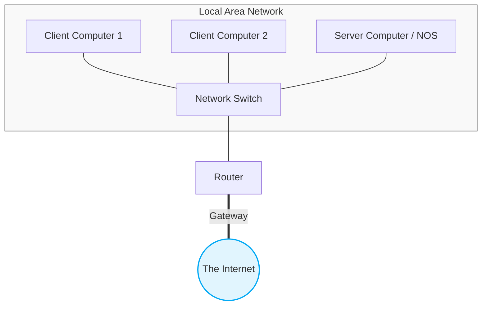
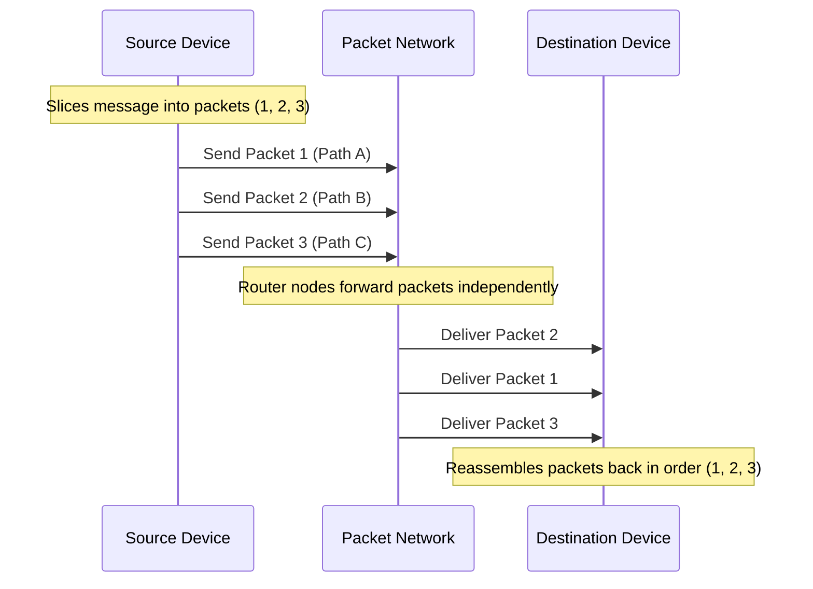
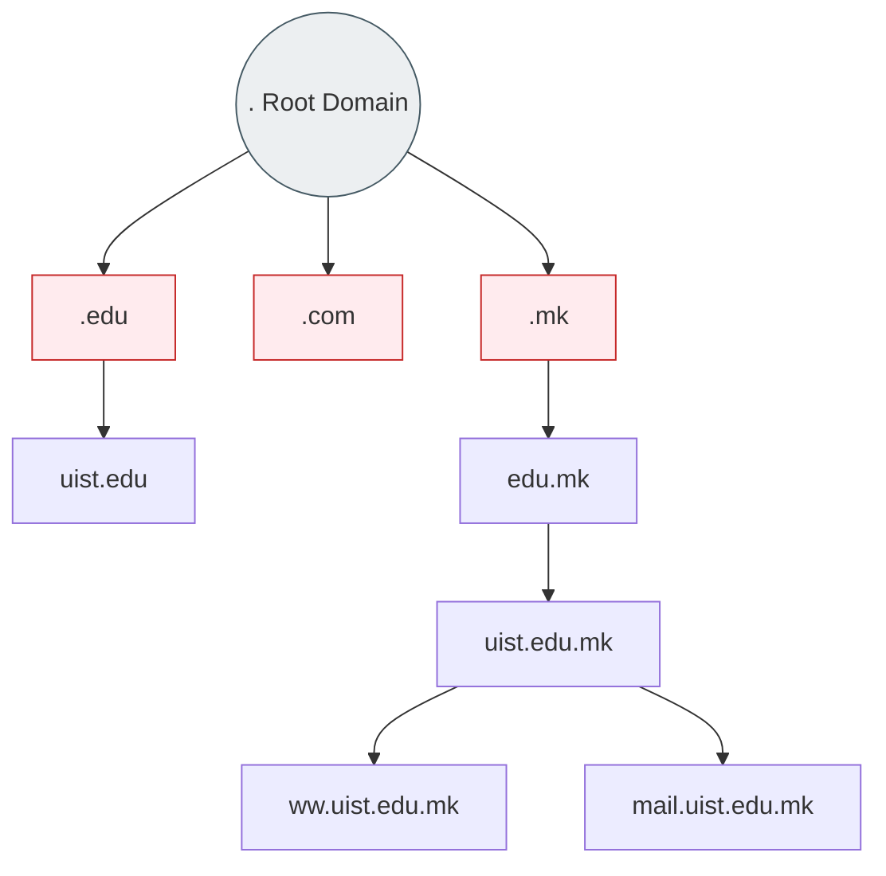
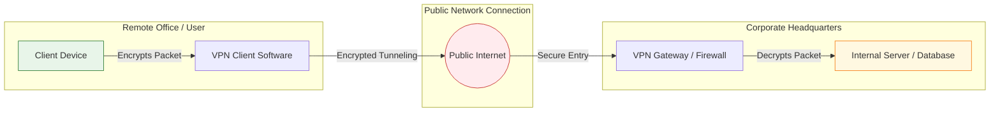
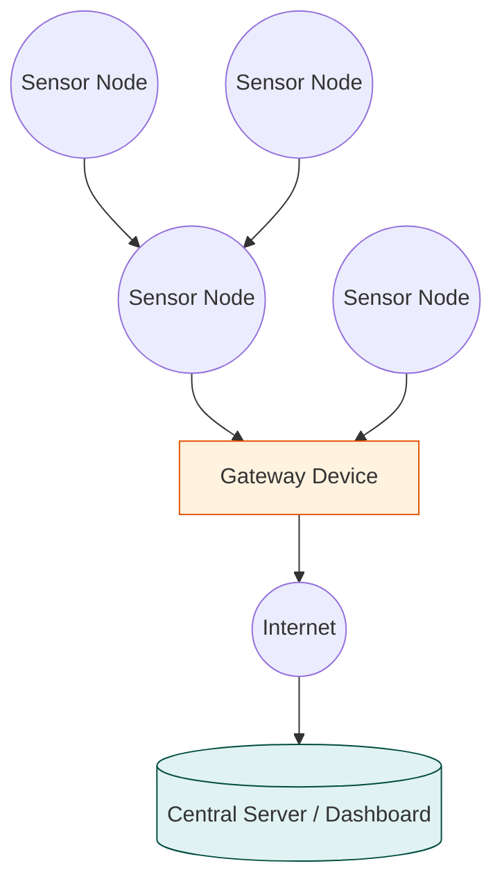

# Management Information Systems

### Управување со информациски системи

**Chapter 7: Telecommunications, the Internet, and Wireless Technology** _Course:_ ICS16M01

_Lecturer:_ Aleksandar Karadimce, PhD

_Institution:_ University St. Paul the Apostle (University for Information Science & Technology - UIST)

_Textbook Reference:_ _Management Information Systems: Managing the Digital Firm_, 17th Edition (ISBN: 978-0-13-697127-6) by Kenneth C. Laudon and Jane P. Laudon (Pearson Education, 2022).

## Table of Contents

1. [Learning Objectives](#learning-objectives "null")
2. [7.1 Telecommunications and Networking in Today's Business World](#71-telecommunications-and-networking-in-todays-business-world "null")
3. [7.2 Types of Communications Networks](#72-types-of-communications-networks "null")
4. [7.3 The Global Internet & Internet Technology](#73-the-global-internet--internet-technology "null")
5. [7.4 The Wireless Revolution](#74-the-wireless-revolution "null")
6. [Hands-On MIS Projects](#hands-on-mis-projects "null")

## Learning Objectives

- **7.1** What are the principal components of telecommunications networks and key networking technologies?

- **7.2** What are the different types of networks?    

- **7.3** How do the Internet and Internet technology work, and how do they support communication and e-business?

- **7.4** What are the principal technologies and standards for wireless networking, communication, and Internet access?

## 7.1 Telecommunications and Networking in Today's Business World
### Networking and Communication Trends

- **Convergence:** [^1] Telephone networks and computer networks are converging into a single digital network using shared Internet standards (e.g., Voice over IP - VoIP).

- **Broadband:**[^2] High-speed, high-bandwidth connections have become the baseline standard for homes and businesses.

- **Wireless Access:** Mobile internet access has grown exponentially with Wi-Fi, 4G, and 5G networks, allowing work to happen anywhere, anytime.

### What is a Computer Network?

A basic computer network consists of two or more connected computers. The core components of a simple network include:

- **Client & Server Computers:** Clients make requests, while servers process and fulfill those requests.
- **Network Interfaces (NICs):** Device controllers that link the computer to the network.
- **Connection Medium:** Telephone wire, coaxial cable, fiber-optic cable, or wireless radio signals.
- **Network Operating System (NOS):** Routes and manages communications on the network and coordinates network resources (e.g., Windows Server, Linux).
- **Hubs, Switches, and Routers:**
    - _Hubs:_ Simple devices that connect network components, sending a packet of data to all other connected devices.
    - _Switches:_ More efficient than hubs; they filter and forward data to a specified destination on the local network.
    - _Routers:_ Device processors used to route packets of data through different networks, ensuring the data sent gets to the correct address.
        

- **Software-Defined Networking (SDN):** A modern networking approach where control functions are managed by a central program, which can run on inexpensive servers, separate from the network hardware itself.

### Key Digital Networking Technologies
Contemporary digital networks are shaped by three key technologies:

1. **Client/Server Computing:**
    - Distributed computing model where some of the processing power is located within small, inexpensive client computers.
    - The client is linked to another computer (the server) through a network.
    - This model has largely replaced centralized mainframe computing.
        
2. **Packet Switching:**
    - Method of slicing digital messages into parcels called **packets**, sending the packets along different communication paths as they become available, and then reassembling the packets once they arrive at their destinations.
    - Prior to packet switching, networks used _circuit-switched_ networks (like traditional telephone lines), which required a dedicated, continuous connection.

3. **TCP/IP and Connectivity:**
    
    - **Protocols:** Rules and procedures governing transmission of information between two points in a network.
    - **TCP/IP (Transmission Control Protocol/Internet Protocol):** The dominant, worldwide standard suite of protocols used to connect diverse hardware and software platforms over the internet.
        - _TCP:_ Handles the movement of data between computers; assembles and disassembles packets.
        - _IP:_ Responsible for delivery of packets, including disassembling and reassembling packets during transmission.

| #   | Name           |
| --- | -------------- |
| 1   | Application    |
| 2   | Transport      |
| 3   | Network        |
| 4   | Network Access |

## 7.2 Types of Communications Networks
### Physical Transmission Media
Networks use different physical channels to transmit data, each with distinct speed, cost, and capacity characteristics:

- **Twisted Pair Wire (Cat 5/6):** Strands of copper wire twisted in pairs. Commonly used for local telephone and Ethernet connections. Relatively slow but inexpensive and easy to install.
- **Coaxial Cable:** Thickly insulated copper wire. Can transmit a larger volume of data than twisted pair. Commonly used for cable television and high-speed internet.
- **Fiber-Optic Cable:** Bundles of thin strands of glass fiber that transmit data as light pulses. Extremely fast, lightweight, and secure, but expensive and difficult to install.
- **Wireless Transmission Media:** Relies on radio, microwave, or infrared signals.
    - _Microwave:_ High-frequency radio signals sent over long distances along line-of-sight paths.
    - _Satellite:_ Communications satellites in orbit serve as relay stations for microwave signals.

### Transmission Speed and Bandwidth

- **Bits per second (bps):** The unit of measurement for the rate of digital data transmission.
    
- **Hertz (Hz):** The measure of physical transmission frequency.
    
- **Bandwidth:** The range of frequencies that can be accommodated on a single telecommunications channel. It represents the maximum amount of data that can be transmitted through the channel, calculated as the difference between the highest and lowest frequencies of the band:
    
    $$\text{Bandwidth} = f_{\text{high}} - f_{\text{low}}$$

### Types of Networks by Geographic Scope

- **Local Area Network (LAN):** Connects personal computers and other digital devices within a limited geographical area (up to 500 meters), such as an office, floor, or building.
    - _Ethernet:_ The dominant LAN standard for physical connections.
    - _Peer-to-Peer (P2P):_ LAN architecture where computers on the network treat each other as equals, sharing files and peripherals without a central server.

- **Campus Area Network (CAN):** Spans a university campus or corporate facility (up to 1,000 meters).
   
- **Metropolitan Area Network (MAN):** Covers a larger city or metropolitan area.

- **Wide Area Network (WAN):** Spans broad geographical distances—entire regions, countries, or the globe. The Internet is the most prominent WAN.
   
- **Personal Area Network (PAN):** Very short-range wireless network linking personal devices (e.g., Bluetooth connecting a phone to wireless earbuds).
    

## 7.3 The Global Internet & Internet Technology

### Internet Architecture and Addressing

The Internet is a vast, global network of networks.

- **IP Addressing:** Every device on the Internet is assigned a unique numeric identifier called an **IP Address**.
    
    - _IPv4:_ The traditional 32-bit addressing system (e.g., `192.168.1.1`), which provides roughly 4.3 billion unique addresses.
        
    - _IPv6:_ The newer 128-bit addressing system designed to replace IPv4 due to address exhaustion. It can support over $3.4 \times 10^{38}$ unique addresses.
        
- **Domain Name System (DNS):** Converts user-friendly domain names (e.g., `www.uist.edu.mk`) into numeric IP addresses that computers can understand.
    

### Internet Services & Communication Tools

- **E-mail:** Person-to-person messaging and document sharing.
- **Chat and Instant Messaging (IM):** Real-time interactive text-based communication.
- **Voice over IP (VoIP):** Delivers voice information in digital form using packet switching[^3], avoiding the toll charges of traditional switched telephone networks.
- **Unified Communications (UC):** Integrates disparate channels for voice communications, data communications, instant messaging, email, and electronic conferencing into a single experience.
- **Virtual Private Network (VPN):** A secure, encrypted, private connection configured within a public network (like the Internet). It uses a technique called _tunneling_ to wrap data packets inside public packets for security.

### The World Wide Web (WWW)
The Web is an information system where documents and other web resources are identified by URLs, interlinked by hypertext, and accessible via the Internet.
- **Hypertext Markup Language (HTML):** Formats documents and incorporates dynamic links to other documents and pictures.
- **Hypertext Transfer Protocol (HTTP):** The communications standard used to transfer pages on the Web.
- **Uniform Resource Locator (URL):** The global address of documents and other resources on the World Wide Web.
    - _Example:_ `https://www.uist.edu.mk/academics/courses`
        - `https` = Protocol
        - `www.uist.edu.mk` = Domain name
        - `/academics/courses` = Directory path / document name

#### Web Search and Commercial Tools
- **Search Engines:** Essential tools for navigating the web (e.g., Google, Bing). They index web pages using automated software programs called _spiders_ or _web crawlers_.
- **Search Engine Optimization (SEO):** The process of improving the volume and quality of traffic to a website from search engines through organic search results.
- **Search Engine Marketing (SEM):** Paid placement of links in search engine results.
- **Web 2.0:** Highly interactive, user-driven web applications (e.g., social media, blogs, wikis, and video sharing sites).
- **Web 3.0 (Semantic Web):** Efforts to make the web more intelligent, machine-readable, and highly personalized (incorporating AI, IoT, and natural language processing).

## 7.4 The Wireless Revolution
### Cellular Systems
- **3G Networks:** First generation to support mobile broadband, suitable for email and basic web browsing, with speeds up to 2 Mbps.
- **4G Networks:** High-speed broadband mobile network with speeds up to 100 Mbps, optimized for video streaming and data-intensive services.
- **5G Networks:** Next-generation wireless networks offering ultra-low latency, speeds exceeding 1 Gbps, and massive capacity to support millions of IoT devices simultaneously.

### Wireless Computer Networks and Internet Access
- **Bluetooth (802.15):** Low-power, short-range wireless network standard (typically up to 10 meters) used to connect peripheral devices like keyboards, mice, and headphones to PCs and phones.
- **Wi-Fi (802.11):** Wireless local area network (WLAN) standard. Access points connect wireless devices to wired networks.
- **WiMAX (802.16):** Worldwide Interoperability for Microwave Access. Designed for high-speed wireless internet over larger metropolitan areas (up to 30 miles).
    

### Radio Frequency Identification (RFID) and Wireless Sensor Networks
- **RFID (Radio Frequency Identification):**
    - Uses tiny tags with embedded microchips containing data about an item and its location.
    - An antenna/reader transmits radio signals to read and write data to the tags without line-of-sight contact.
    - Widely used in supply chain management, inventory tracking, and payment systems.

- **Wireless Sensor Networks (WSNs):**
    - Networks of interconnected wireless devices (sensors) embedded in the physical environment.
    - Used to monitor physical or environmental conditions (temperature, sound, movement) and pass data through the network to a main location.
    - Crucial for IoT (Internet of Things) deployments in smart cities, manufacturing, and environmental monitoring.
        

## Hands-On MIS Projects
### Project 1: Evaluate Wireless Services (Spreadsheet Exercise)

- **Objective:** Analyze telecommunications services and costs to find the most economical solution for a corporate sales force.
    
- **Scenario:** You want to equip your sales force of **35 employees** with mobile devices capable of:
    
    - Voice transmission
        
    - Text messaging
        
    - Internet access
        
    - Taking and sending photos
        
- **Tasks:**
    
    1. Use the web to research **two major wireless providers** that offer nationwide voice and data services (as well as good coverage in your local area).
        
    2. Examine and compare the features of the handset models and cellular plans offered by each.
        
    3. Create a spreadsheet model to determine the total cost of ownership (handsets + service charges) per user and in aggregate over a **two-year period** (24 months).
        
    4. Identify which vendor offers the best pricing structure. (Do not apply corporate discounts for this specific exercise).
        

### Project 2: Web Search Engines for Business Research

- **Objective:** Compare web search tools and analyze information quality for emerging technologies.
    
- **Tasks:**
    
    1. Use **Google** and **Bing** to gather information on **ethanol** as an alternative fuel source for motor vehicles. (Optional: try other search engines like DuckDuckGo).
        
    2. Evaluate and document:
        
        - The volume of results generated by each search engine.
            
        - The quality and commercial bias of the top-ranked results.
            
        - The ease of use of each interface.
            
        - Which search engine yielded the most useful, relevant results for professional business research and why.

[^1]: convergence

[^2]: Broadband

[^3]: packet swithing 
