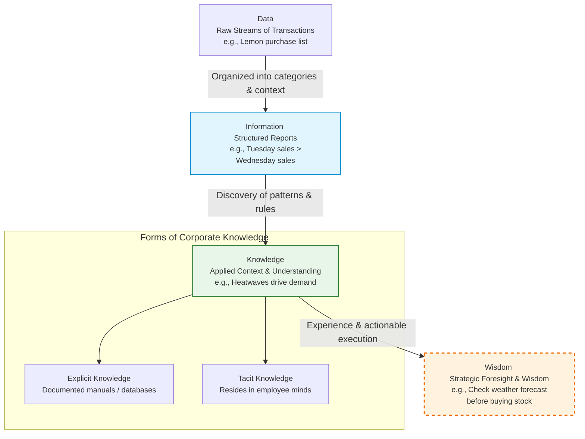
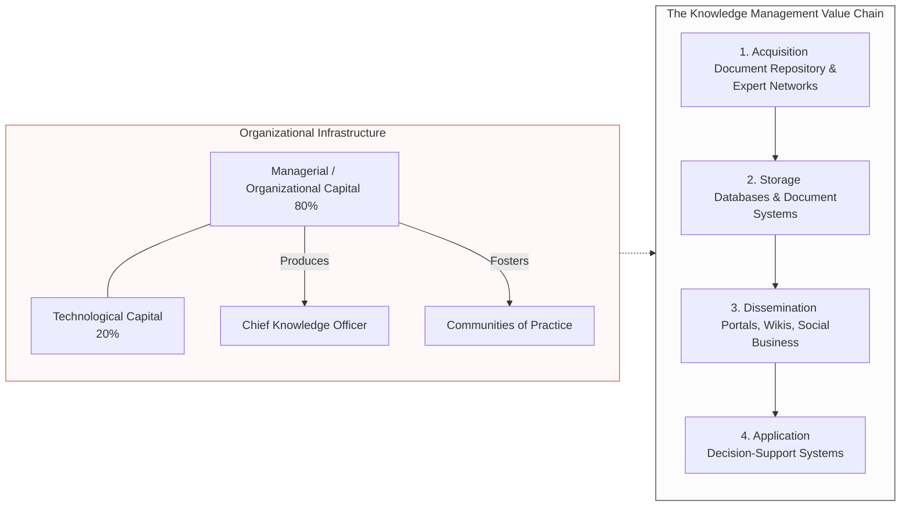
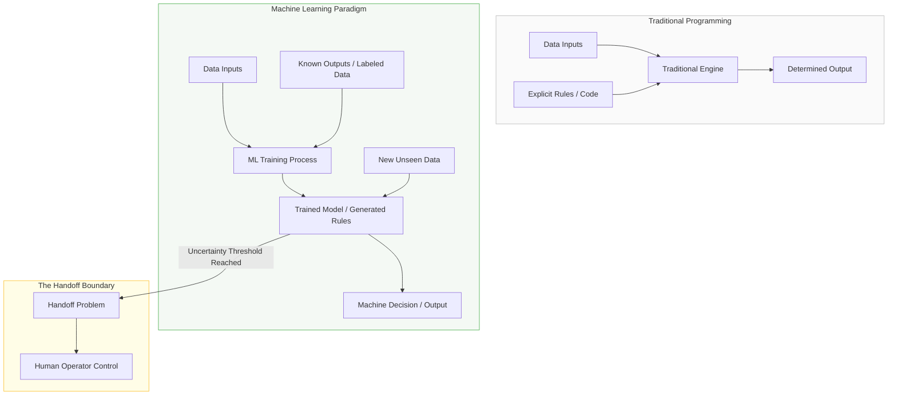
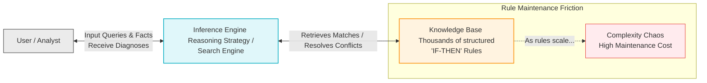

# Chapter 11: Managing Knowledge and Artificial Intelligence

Welcome to the lecture. As we explore **Chapter 11: Managing Knowledge and Artificial Intelligence**, we are moving into the "cognitive" layer of the digital firm. We are no longer just looking at how data flows, but how a firm "thinks," "remembers," and "learns" to create a competitive advantage.

## I. The Dimensions of Knowledge: From Raw Data to Organizational Wisdom

### 1. The "Stupid Simple" Underlying Logic (0 to 30)

Imagine you are running a lemonade stand. **Data** is just a list of every lemon you bought. **Information** is knowing that you sold more lemonade on Tuesday than Wednesday. **Knowledge** is realizing it was hotter on Tuesday, so heat probably drives sales. **Wisdom** is knowing to check the weather forecast before buying your lemons next week. Without this progression, you are just reacting to the past rather than mastering the future.

### 2. The Working Blueprint (30 to 70)

In a digital firm, **data** are raw streams of transactions. To become **information**, the firm must expend resources to organize this data into categories like monthly or regional reports. **Knowledge** occurs when the firm discovers patterns, rules, and contexts where that information works. Finally, **wisdom** is the collective and individual experience of applying that knowledge to solve specific business problems. This knowledge exists in two forms:

- **Explicit knowledge**: documented knowledge (like a manual).
    
- **Tacit knowledge**: unstructured knowledge that resides in the minds of employees and has not been documented.
    

### 3. Advanced Architecture & Nuance (70 to 100)

Knowledge is a unique corporate asset. Unlike physical assets, it is intangible and subject to **network effects**—its value increases as more people share it. Strategically, knowledge is "sticky" (hard to move), situational (it only works in certain contexts), and contextual (you must know how to use a tool and under what circumstances).

The management dimension here is critical: knowledge is both an individual and a collective attribute of the firm. If a firm knows how to do something effectively and efficiently in a way others cannot duplicate, it possesses a primary source of profit and competitive advantage.



## II. The Knowledge Management Value Chain

### 1. The "Stupid Simple" Underlying Logic (0 to 30)

Think of a professional kitchen. You have to buy the ingredients (**Acquisition**), put them in the pantry so you can find them later (**Storage**), tell the chefs the recipe (**Dissemination**), and actually cook the meal (**Application**). If you buy the best steak but leave it in the alley or forget to tell the chef it's there, you can't sell it. Knowledge management is just making sure the "good ideas" get to the "right people" to make "better stuff."

### 2. The Working Blueprint (30 to 70)

The value chain consists of business processes that add value to raw data:

- **Knowledge Acquisition:** Firms build repositories of documents or use **expert networks** to find the right person in the company.
    
- **Knowledge Storage:** This involves creating databases and **document management systems** that index and tag content.
    
- **Knowledge Dissemination:** Using portals, wikis, and social business tools to ensure employees find what is important.
    
- **Knowledge Application:** To provide a return on investment, knowledge must be built into business processes and **decision-support systems**.
    

### 3. Advanced Architecture & Nuance (70 to 100)

The "$80/20$ rule" of knowledge management states that success is $80\%$ managerial/organizational and only $20\%$ technological. To maximize returns, firms must build **organizational and management capital**. This includes creating roles like the **Chief Knowledge Officer (CKO)** and fostering **Communities of Practice (COPs)**—informal social networks of professionals who share experiences and solve problems together. These COPs reduce the learning curve for new employees and act as a spawning ground for new ideas.



## III. Artificial Intelligence (AI) and Machine Learning

### 1. The "Stupid Simple" Underlying Logic (0 to 30)

Traditional computer programs are like a rigid recipe: "If it's 5:00 PM, turn on the lights." **AI** is trying to build a program that can look at the room, notice it's getting dark, and _decide_ to turn on the lights itself. **Machine Learning** is like a student who doesn't need to be told the rules; they just look at 10,000 examples and figure out the rules for themselves.

### 2. The Working Blueprint (30 to 70)

AI is a family of techniques that take data input, process it, and produce outputs that can equal or exceed human capabilities in specific tasks. **Machine Learning (ML)** is software that identifies patterns in massive datasets without explicit programming. This is often done via:

- **Supervised learning:** Humans provide labeled examples of desired inputs and outputs.
    
- **Unsupervised learning:** The system processes an unlabeled database and reports whatever patterns it finds.
    

### 3. Advanced Architecture & Nuance (70 to 100)

We are currently in the era of **Narrow AI**, which performs specific tasks, rather than "Grand Vision" AI that demonstrates generalized human intelligence. The evolution of AI is driven by **Big Data**, drastic reductions in processing costs, and the refinement of algorithms. A major structural nuance is the **handoff problem**: in semi-autonomous systems, the machine must determine when it can no longer handle a situation and must signal a human to take over.



## IV. Expert Systems and Case-Based Reasoning

### 1. The "Stupid Simple" Underlying Logic (0 to 30)

Imagine an old, master mechanic who has fixed every car problem for 40 years. Before he retires, you sit him down and ask him every "If... then..." rule he knows. You write them in a book. Now, a 16-year-old can use that book to fix cars like a master. That is an **Expert System**.

### 2. The Working Blueprint (30 to 70)

Expert systems model human knowledge as a set of rules collectively called the **knowledge base**. The strategy used to search through these rules and formulate conclusions is the **inference engine**. These systems are used for discrete, highly structured tasks like granting credit or diagnosing equipment problems.

### 3. Advanced Architecture & Nuance (70 to 100)

The tradeoff with Expert Systems is **rule maintenance friction**. Knowledge bases can become chaotic as rules reach into the thousands. They do not scale well to unstructured problems and do not use real-time data to guide decisions. They are best suited for small domains of expert knowledge where the rules rarely change.



## V. Neural Networks and Deep Learning

### 1. The "Stupid Simple" Underlying Logic (0 to 30)

Imagine a huge group of people trying to guess what is in a blurry picture. Each person looks at one tiny piece. They pass their guess to a second group of people, who combine those guesses. If the final guess is right, everyone who was right gets a "point" and becomes more influential. If it's wrong, they lose influence. After 10 million pictures, the group becomes incredibly good at guessing.

### 2. The Working Blueprint (30 to 70)

A **neural network** is composed of interconnected "neurons" (software programs and mathematical models). Researchers use a **Learning Rule** to systematically alter the "weight" (strength) of connections among neurons to produce a desired output. **Deep learning** uses multiple layers of these networks to reveal underlying patterns in data.

### 3. Advanced Architecture & Nuance (70 to 100)

These are essentially **pattern detection programs**. They are used when data is too complicated for a human to analyze, such as identifying fraudulent credit card transactions or suspicious calling patterns. However, they require massive datasets and high-velocity computing to be effective.

```
graph LR
    %% Deep Learning Architecture %%
    subgraph Input_Layer [Input Layer]
        I1(Raw Data / Signals)
    end

    subgraph Hidden_Layers [Hidden Layers - Deep Learning Features]
        H1a(Feature 1: Edges) --> H2a(Feature 2: Shapes)
        H1b(Feature 1: Edges) --> H2b(Feature 2: Shapes)
    end

    subgraph Output_Layer [Output Layer]
        O1(Classification / Guess)
    end

    I1 --> H1a & H1b
    H1a --> H2a & H2b
    H1b --> H2a & H2b
    H2a & H2b --> O1

    O1 -->|Compute Error vs Target| Loss[Learning Rule Process]
    Loss -.->|Backpropagation: Adjust Connection Weights| H1a & H1b & H2a & H2b

    style Input_Layer fill:#fafafa,stroke:#ccc
    style Hidden_Layers fill:#f3e5f5,stroke:#8e24aa
    style Output_Layer fill:#e8f5e9,stroke:#4caf50
    style Loss fill:#ffebee,stroke:#f44336
```

## VI. Genetic Algorithms

### 1. The "Stupid Simple" Underlying Logic (0 to 30)

This is "Digital Darwinism." You have a problem, so you generate 100 random solutions. You "kill off" the 90 worst ones. You take the 10 best, "breed" them together to create new solutions, and throw in a few "mutations" (random changes). You repeat this 1,000 times until you have a "super-solution."

### 2. The Working Blueprint (30 to 70)

Genetic algorithms are optimization techniques based on evolutionary natural selection and mutation. They represent a solution as a string of 0s and 1s (chromosomes) and evaluate thousands of alternatives to find the "fittest" solution to a problem.

### 3. Advanced Architecture & Nuance (70 to 100)

They are strategically used for search and optimization problems where the number of variables is too large for humans or traditional systems to evaluate. They are effective for finding the "optimal" solution from a vast pool of possibilities.

```
graph TD
    %% Genetic Algorithm Loop %%
    Start[1. Initialize Population <br> Random Solution Chromosomes 0s & 1s] --> Eval[2. Test Fitness <br> Evaluate each against optimization criteria]
    Eval --> Selection[3. Natural Selection <br> Discard poorest; retain fittest parent designs]
    Selection --> Crossover[4. Crossover / Breeding <br> Combine traits of fittest parents]
    Crossover --> Mutation[5. Mutation <br> Introduce random alterations to genetic strings]
    Mutation --> Criteria{Is Optimal Solution <br> Found or Epoch Limit Reached?}
    Criteria -->|No| Eval
    Criteria -->|Yes| End[Optimal Super-Solution Output]

    style Eval fill:#e1f5fe,stroke:#0288d1
    style Selection fill:#ffebee,stroke:#c62828
    style Crossover fill:#e8f5e9,stroke:#2e7d32
    style Criteria fill:#fffde7,stroke:#fbc02d
```

## VII. NLP, Computer Vision, and Robotics

### 1. The "Stupid Simple" Underlying Logic (0 to 30)

- **NLP** is the computer learning to understand human "slang" and context.
    
- **Computer Vision** is the computer "seeing" and recognizing objects.
    
- **Robotics** is the computer moving a physical body to perform a human task.
    

### 2. The Working Blueprint (30 to 70)

- **Natural Language Processing (NLP):** Algorithms that analyze language human beings instinctively use.
    
- **Computer Vision Systems:** Emulate the human visual system to view and extract information from real-world images.
    
- **Robotics:** Programmable machines that substitute for human movements, often in dangerous or precision-heavy environments.
    

### 3. Advanced Architecture & Nuance (70 to 100)

NLP systems, like those at Mizuho Bank, use ML to infer customer needs and formulate optimal responses in real-time. Computer vision systems like Facebook’s **DeepFace** are now nearly as accurate as the human brain. Strategically, these tools allow for **operational intelligence**, such as robots delivering supplies in contaminated locations.

```
mindmap
  root((Cognitive & Physical AI))
    NLP
      Semantic Analysis
      Real-Time Sentiment
      Application: Mizuho Bank Customer Support
    Computer Vision
      Feature Extraction
      Spatial Mapping
      Application: Facebook DeepFace System
    Robotics
      Precision Automation
      Hazardous Environment Operations
      Application: Automated Delivery Robots
```

## VIII. Intelligent Agents (Shopping Bots & Chatbots)

### 1. The "Stupid Simple" Underlying Logic (0 to 30)

Imagine a tiny, invisible robot that lives inside your computer. You tell it, "Find me the cheapest flight to Tokyo," and it runs out into the Internet, talks to all the airlines, ignores the junk, and comes back with the answer while you sleep.

### 2. The Working Blueprint (30 to 70)

Intelligent agents work in the background without direct human intervention. **Shopping bots** filter information based on user criteria and can sometimes negotiate price. **Chatbots** are designed to simulate human conversation via text or voice to handle customer service inquiries.

### 3. Advanced Architecture & Nuance (70 to 100)

Firms like **Procter & Gamble** use agent-based modeling to treat supply chain components as "semi-autonomous agents". By simulating their behavior using "if-then" rules (e.g., "order an item when stock is low"), P&G saved $300 million annually on an investment of less than 1 percent of that amount.

```
sequenceDiagram
    %% Agent-Based Interaction Protocol %%
    autonumber
    actor User as User or Business Manager
    participant Agent as Intelligent Agent / Bot
    participant Web as Target Networks / Suppliers

    User->>Agent: Define rules & objectives (e.g., "Keep inventory above 20%")
    activate Agent
    loop Autonomous Background Monitoring
        Agent->>Web: Query real-time inventory & price points
        Web-->>Agent: Data feed response
    end
    Note over Agent: Decision Rule triggered:<br>Stock < 20%
    Agent->>Web: Execute Automated Restock Order / Negotiation
    Web-->>Agent: Transaction confirmation
    Agent->>User: Notify action completed (Saved costs / filled inventory)
    deactivate Agent
```

## IX. Enterprise-Wide Knowledge Management Systems (ECM & LMS)

### 1. The "Stupid Simple" Underlying Logic (0 to 30)

**ECM** is a giant, smart file cabinet for the whole company. **LMS** is a digital schoolhouse that tracks which "classes" every employee has taken so the company knows who is actually trained to do what.

### 2. The Working Blueprint (30 to 70)

- **Enterprise Content Management (ECM)** systems help firms manage both structured (reports) and semistructured (email, video) knowledge. They use **taxonomies** and **tagging** to make content searchable.
    
- A **Learning Management System (LMS)** provides tools for delivery, tracking, and assessment of employee training.
    

### 3. Advanced Architecture & Nuance (70 to 100)

ECM systems solve the problem of "semistructured" knowledge, which accounts for $80\%$ of a firm's content. Strategically, they provide a single point of access via **knowledge portals** and include **Digital Asset Management** to ensure brand consistency across global offices.

```
graph TD
    %% Enterprise Systems Integration %%
    subgraph ECM [Enterprise Content Management]
        Struct[Structured Data <br> Financial & DB Reports] & Semi[Semistructured Data <br> Emails, PDFs, Video, Graphics] --> Engine[Taxonomy & Metadata Tagging Engine]
        Engine --> Portal[Centralized Knowledge Portal]
    end

    subgraph LMS [Learning Management System]
        Curriculum[Training Modules & Compliance Classrooms] --> Tracker[Progress Tracking & Certifications]
        Tracker --> Performance[Employee Competency Assessment]
    end

    Portal <--> LMS
    style ECM fill:#e8eaf6,stroke:#3f51b5
    style LMS fill:#e0f2f1,stroke:#009688
```

## X. Knowledge Work Systems (KWS)

### 1. The "Stupid Simple" Underlying Logic (0 to 30)

Normal office workers need a desk and a laptop. Knowledge workers (like engineers) need a "super-desk" with giant screens and specialized tools that let them "build" things in 3D before they ever buy raw materials.

### 2. The Working Blueprint (30 to 70)

**Knowledge Work Systems (KWS)** are specialized workstations for scientists and engineers. They require powerful graphics, analytical tools, and fast access to external databases. Examples include **CAD** (Computer-Aided Design), **3-D Printing** (additive manufacturing), and **Virtual Reality (VR)**.

### 3. Advanced Architecture & Nuance (70 to 100)

KWS drive massive efficiencies. For example, **Augmented Reality (AR)** used in US Navy shipbuilding allowed engineers to see final designs superimposed on ships, reducing inspection time by $96\%$.

**Tradeoff:** These systems are expensive, and the time knowledge workers spend learning them must be balanced against their high productivity cost.

```
graph LR
    %% KWS Input and Output Architecture %%
    subgraph Inputs [KWS Dependencies]
        H[High-Power Graphics Workstations]
        D[External Science / Industry Databases]
    end

    subgraph Engine [Specialized Platforms]
        KWS{Knowledge Work System}
    end

    subgraph Applications [Outputs / Implementations]
        CAD[CAD Systems <br> Interactive 3D Designs]
        AM[Additive Manufacturing <br> 3-D Printing Prototyping]
        VR[Virtual Reality <br> Immersive Simulations]
        AR[Augmented Reality <br> Superimposed Inspection <br> 96% Time Savings]
    end

    H & D --> Engine
    Engine --> CAD & AM & VR & AR

    style Engine fill:#fffde7,stroke:#fbc02d,stroke-width:2px
```

## Socratic Evaluation: Deep Conceptual Mastery

1. If "sticky" knowledge is a primary source of competitive advantage, why should a firm invest in Enterprise Content Management (ECM) systems that explicitly aim to make that knowledge "un-sticky" and easily distributed?
    
2. Defend the decision to use a Genetic Algorithm over an Expert System for a firm trying to optimize its global shipping routes. What structural constraints in the data make the Expert System a poor choice?
    
3. An organization implements a high-end Machine Learning system for fraud detection but ignores the "Management and Organizational" layer of the value chain. Predict two specific ways this system will fail to provide business value despite its technical accuracy.
    
4. Compare the "rule maintenance friction" of an Expert System with the "training data bias" of a Neural Network. Which is more dangerous for a digital firm scaling to a global market, and why?
    
5. Why does the "handoff problem" in autonomous vehicles represent a failure of current AI architecture to achieve "Grand Vision" artificial intelligence?
    
6. Analyze the role of a "Taxonomy" in an ECM. If the taxonomy is poorly designed by management, how does it physically degrade the "Dissemination" and "Application" stages of the knowledge value chain?
    
7. A CEO wants to replace $50\%$ of the customer service staff with Chatbots. Reconcile this decision with the "Tacit Knowledge" dimension. What is the firm at risk of losing permanently if they proceed?
    
8. How does the "Law of Mass Digital Storage" fundamentally enable Deep Learning, and why would this technology have been structurally impossible to implement in the 1980s?
    
9. In the context of Knowledge Work Systems (KWS), argue why Augmented Reality (AR) might provide a higher ROI than Virtual Reality (VR) for a manufacturing firm.
    
10. If Communities of Practice (COPs) are informal and social, how can management "control" them to ensure they align with the firm's strategic business objectives?